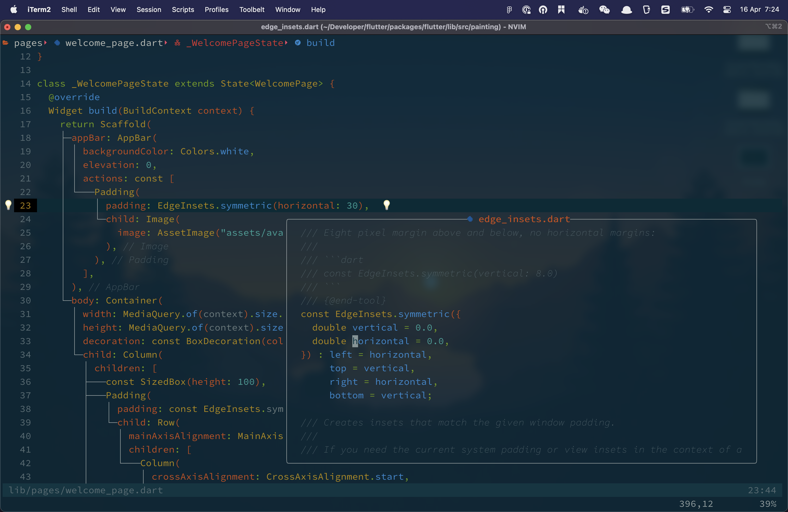

# My Neovim Environment Setup 🚀

# Clone My Setup

**If you donot care below XZY setups, just want to have a some setup with me, simply download [clone_my_setup.sh](https://github.com/nickdevhouse/dotfiles/blob/main/clone_my_setup.sh) and run below scripts**

**IMPORTANT:** Backup your own setup first, just in case you want it back. Proceed at your own risk! Cheers~ Happy coding.

```
bash clone_my_setup.sh
```

👇 **Further more info about my setup.** 👇





# Terminal Setup

### Install Homebrew

```
/bin/bash -c "$(curl -fsSL https://raw.githubusercontent.com/Homebrew/install/HEAD/install.sh)"
```

### Install iTerm2

```
brew install iterm2
```

**Color Presets**: [dotfiles/iTerm_presets.itermcolors](dotfiles/iTerm_presets.itermcolors)

**Font**: [SauceCodePro Nerd Font](https://www.nerdfonts.com/font-downloads)

### Install Git

```
brew install git
```

### Install Fish shell

```
brew install fish
```

#### Install Fisher (A plugin manager for Fish)

```
curl -sL https://raw.githubusercontent.com/jorgebucaran/fisher/main/functions/fisher.fish | source && fisher install jorgebucaran/fisher
```

#### Install [z for fish](https://github.com/jethrokuan/z')

```
fisher install jethrokuan/z
```

#### Install [Exa](https://the.exa.website/)

```
brew install exa
```

#### Install [ghq](https://github.com/x-motemen/ghq)

```
brew install ghq
```

#### Install peco: https://github.com/peco/peco

```
brew install peco
```

# Tmux Setup

```
brew install tmux
```

**Configuration**: [dotfiles/.config/tmux/tmux.conf](dotfiles/.config/tmux/tmux.conf)

# Neovim Setup

- Plugin Managment: [wbthomason/packer.nvim](https://github.com/wbthomason/packer.nvim)

- Statusline: [nvim-lualine/lualine.nvim](https://github.com/nvim-lualine/lualine.nvim)

- Plenary: [nvim-lua/plenary.nvim](https://github.com/nvim-lua/plenary.nvim)

- Autocompletion

  - [hrsh7th/nvim-cmp](https://github.com/hrsh7th/nvim-cmp)
  - [hrsh7th/cmp-buffer](https://github.com/hrsh7th/cmp-buffer)
  - [hrsh7th/cmp-path](https://github.com/hrsh7th/cmp-path)

- Snippets

  - [L3MON4D3/LuaSnip](https://github.com/L3MON4D3/LuaSnip)
  - [saadparwaiz1/cmp_luasnip](https://github.com/saadparwaiz1/cmp_luasnip)
  - [rafamadriz/friendly-snippets](https://github.com/rafamadriz/friendly-snippets)

- Formatting & linting

  - [jose-elias-alvarez/null-ls.nvim](https://github.com/jose-elias-alvarez/null-ls.nvim)
  - [jayp0521/mason-null-ls.nvim](https://github.com/jay-babu/mason-null-ls.nvim)

- Managing & installing lsp servers, linters & formatters

  - [williamboman/mason.nvim](https://github.com/williamboman/mason.nvim)
  - [williamboman/mason-lspconfig.nvim](https://github.com/williamboman/mason-lspconfig.nvim)

- Configuring lsp servers

  - [neovim/nvim-lspconfig](https://github.com/neovim/nvim-lspconfig)
  - [hrsh7th/cmp-nvim-lsp](https://github.com/hrsh7th/cmp-nvim-lsp)
  - [glepnir/lspsaga.nvim](https://github.com/glepnir/lspsaga.nvim)
  - [nvim-tree/nvim-web-devicons](https://github.com/nvim-tree/nvim-web-devicons)
  - [nvim-treesitter/nvim-treesitter](https://github.com/nvim-treesitter/nvim-treesitter)
  - [jose-elias-alvarez/typescript.nvim](https://github.com/jose-elias-alvarez/typescript.nvim)
  - [onsails/lspkind.nvim](https://github.com/onsails/lspkind.nvim)
  - [MunifTanjim/prettier.nvim](https://github.com/MunifTanjim/prettier.nvim)

- Fuzzy finding Telescope

  - [nvim-telescope/telescope-fzf-native.nvim](https://github.com/nvim-telescope/telescope-fzf-native.nvim)
  - [nvim-telescope/telescope.nvim](https://github.com/nvim-telescope/telescope.nvim)
  - [nvim-telescope/telescope-file-browser.nvim](https://github.com/nvim-telescope/telescope-file-browser.nvim)

- File explorer [nvim-tree/nvim-tree.lua](https://github.com/nvim-tree/nvim-tree.lua)

- Auto closing

  - [windwp/nvim-autopairs](https://github.com/windwp/nvim-autopairs)
  - [windwp/nvim-ts-autotag](https://github.com/windwp/nvim-ts-autotag)

- Flutter

  - [akinsho/flutter-tools.nvim](https://github.com/akinsho/flutter-tools.nvim)
  - [mfussenegger/nvim-dap](https://github.com/mfussenegger/nvim-dap)

- Git integration

  - [lewis6991/gitsigns.nvim](https://github.com/lewis6991/gitsigns.nvim)
  - [dinhhuy258/git.nvim](https://github.com/dinhhuy258/git.nvim)

- Good to have plugins
  - [svrana/neosolarized.nvim](https://github.com/svrana/neosolarized.nvim)
  - [norcalli/nvim-colorizer.lua](https://github.com/norcalli/nvim-colorizer.lua)
  - [folke/zen-mode.nvim](https://github.com/folke/zen-mode.nvim)
  - [iamcco/markdown-preview.nvim](https://github.com/iamcco/markdown-preview.nvim)
  - [phaazon/hop.nvim](https://github.com/phaazon/hop.nvim)
  - [numToStr/Comment.nvim](https://github.com/numToStr/Comment.nvim)
  - [szw/vim-maximizer](https://github.com/szw/vim-maximizer)
  - [tpope/vim-surround](https://github.com/tpope/vim-surround)
